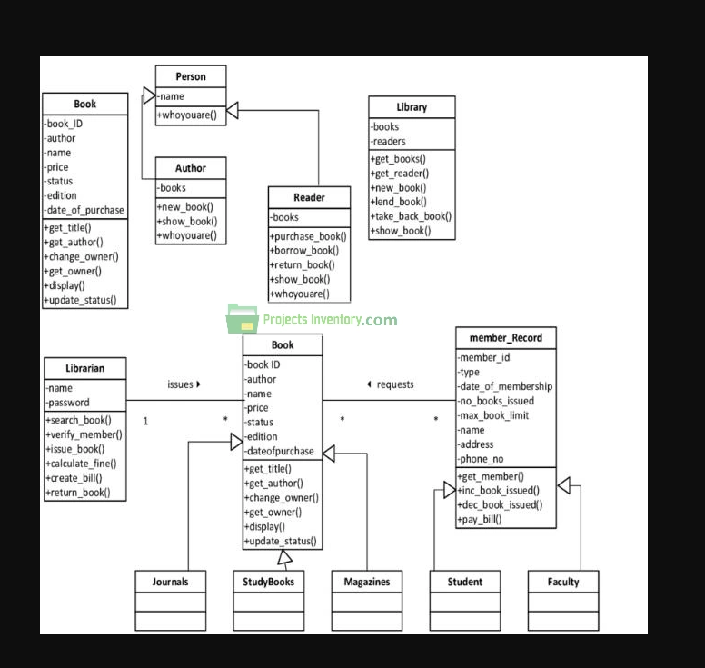

#  Java OOP Design

### Proje Kurulumu

Projeyi öncelikle forklayın ve clone edin.
Daha sonra projeyi IntellijIDEA kullanarak açınız. README.md dosyasını dikkatli bir şekilde okuyarak istenenleri yapmaya çalışın.
Proje sayımız ilerledikçe proje yönetimimizi kolaylaştırmak adına projelerimizi belli klasör kalıplarında saklamak işimizi kolaylaştırmak adına iyi bir alışkanlıktır.
Örnek bir Lokasyon: Workintech/Sprint_1/Etud.

### Hedeflerimiz:

### Library System

 * 
 * Bir kütüphane sistemi modelimiz mevcut.
 * Bu modeli programlamak istiyoruz. Nesne Tabanlı bir uygulama geliştirmek zorundayız.
 * Tamamen özgür bir şekilde istediğiniz türde bir dizayn yapabilirsiniz.
 * Öğrendiğimiz konuları uygulamak hedeflenmektedir.
 * Amacımız bir Kütüphane Otomasyonu dizayn etmek. Ekteki Sınıfları ve aralarındaki ilişkileri kurarak bu sistemi nasıl dizayn edebiliriz?
 * Kendi eklemek istediğiniz özellikleri eklemekten asla çekinmeyiniz.

### Sistemde mutlaka Olmasını İstediklerimiz Nelerdir

* Bütün projeni object oriented design kullanılarak tasarlanmalı ve kodlanmalı
* Projenizde anlamlı paketler oluşturmalı be paketlemeye dikkat etmelisiniz.
* Oluşturduğunuz tüm sınıflar Encapsulation kurallarına uygun yazılmalı.
* Composition uygulaması mutlaka olmalı.
* En az bir tane Inheritance ilişkisi kurmalısınız.
* En az bir tane Abstract class ya da Interface tanımlayarak bunları implements/extends eden sınıflarınız olmalı.
* Projenizde polymorphism uygulamaları olmalı ve yazdığınız metodlar olabildiğince esnek çalışmalı.
* Sisteminizde en az bir list ve bir adet set veri yapısı kullanmalısınız ve anlamlı bir problemi çözüyor olmalı.
* Veri saklamak için mapleri kullanmalısınız.
